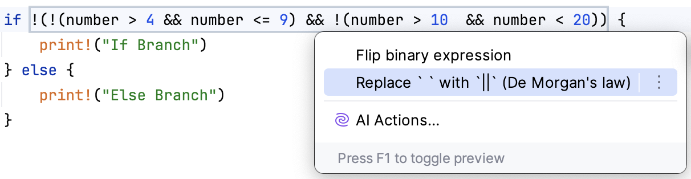

## Mastering the IDE: Managing Conditions

Can you quickly understand what the code from the `main.rs` file prints?
 
%IDE_NAME% has lots of useful features that can help you make the code more readable.

For example, let's apply [DeMorgan's law](https://en.wikipedia.org/wiki/De_Morgan%27s_laws) **quick-fix**.

Place the cursor on `&&` and use the &shortcut:ShowIntentionActions; shortcut to see available context actions.

Now, can you quickly understand what the code from the `main.rs` file prints?

  The resulting if condition should be  
  <code>(number > 4 && number <= 9) || (number > 10 && number < 20)</code>

  The code prints "If Branch"

*Note 1*: `&&` and `||` are [short-circuiting logical operators](https://en.wikipedia.org/wiki/Short-circuit_evaluation)

*Note 2*: Try using &shortcut:ShowIntentionActions; at various places in your code from the previous tasks.
%IDE_NAME% often has useful suggestions on how to improve your code.