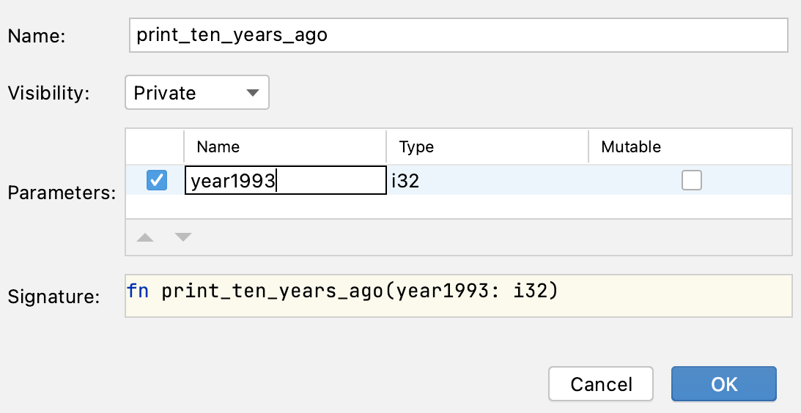

## Mastering the IDE: Extract Method Refactoring
 
A developer was asked to change the message format in the code you see in this task.

Instead of "1993: 10 years ago was 1983", we want to print "1993: ten years ago was 1983".

However, the way it's implemented now, the developer has to modify the message in two places, which would 
become even more inconvenient when this code is used in more places.

So before actually changing the message format, the developer decided to perform refactoring and create a function that prints the message.

### Task

**Step 1: Create a Function**

Perform the refactoring and create a new function to replace the duplicated code.

Select the first occurrence of 

```rust
println!("{}: 10 years ago was {}", year1993, year1993 - 10);
```

and then either press &shortcut:ExtractMethod; or choose *Refactor -> Extract Method...* from the right-click menu.

In the dialog that appears, you can choose a more suitable name for the parameter (for example, year):



**Step 2: Replace the Duplicated Code**

After the new function has been created, replace the second occurrence of the code with the new function call.

**Step 3: Change the Text**

Finally, change "10" to "ten" in the function body.

