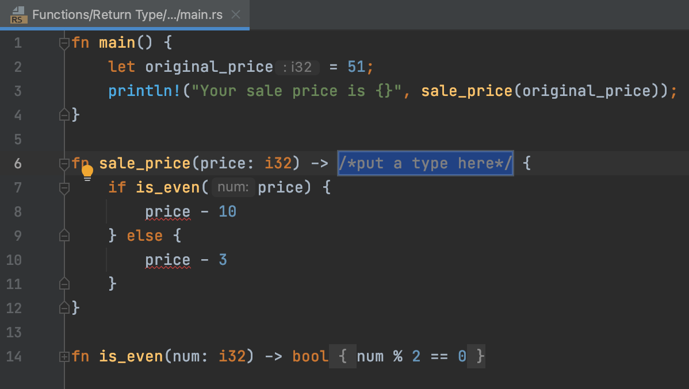

## Editor

The <b>Editor</b> is your playground where you will be programming. You can experiment here while you work on the theoretical tasks and quizzes without being checked.

For programming assignments, the Editor is where you’ll fix the existing code or write your own code from scratch. This code will be checked.

To run your code at any time, choose the Run option from the context menu or press &shortcut:Run;:

If you want to go back to the Editor and focus on your code, the fastest way to do it is with the Hide All Windows command (&shortcut:HideAllWindows;). To get all the windows back, repeat the command.