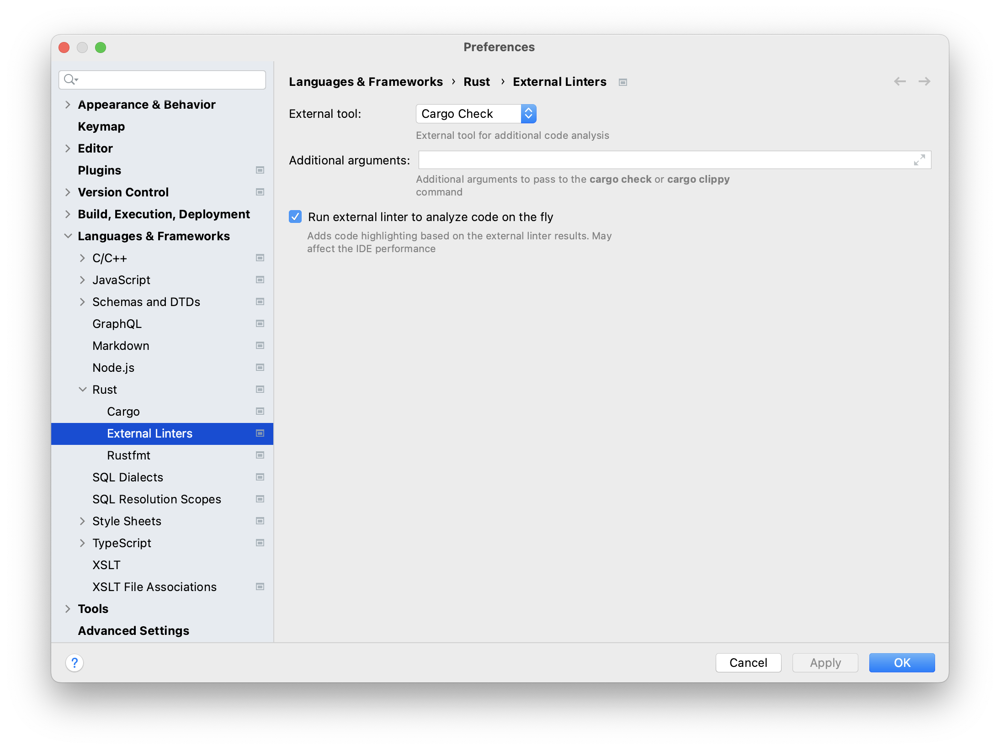

## Enable External Linter

IntelliJ Rust plugin doesn't detect all the errors. It relies on the Rust compiler to do that. While you are learning Rust, it is useful to see errors as you type. To have this behavior, we recommend to enable an external linter as follows:

1. Go to **Settings / Preferences | Languages & Frameworks | Rust | External Linters** (or directly **Settings / Preferences | Rust | External Linters** if opened in RustRover).
2. Set the parameters as follows: 
    - Select **Cargo Check** in the **External Tool:** list;
    - Check the **Run external linter to analyze code on the fly** checkbox.

3. Press **OK**.

Once you do that, %IDE_NAME% will report all the errors IntelliJ Rust plugin or Rust compiler detect.
