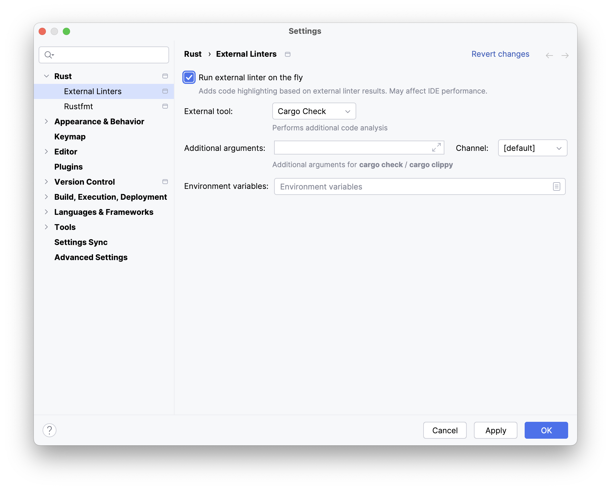
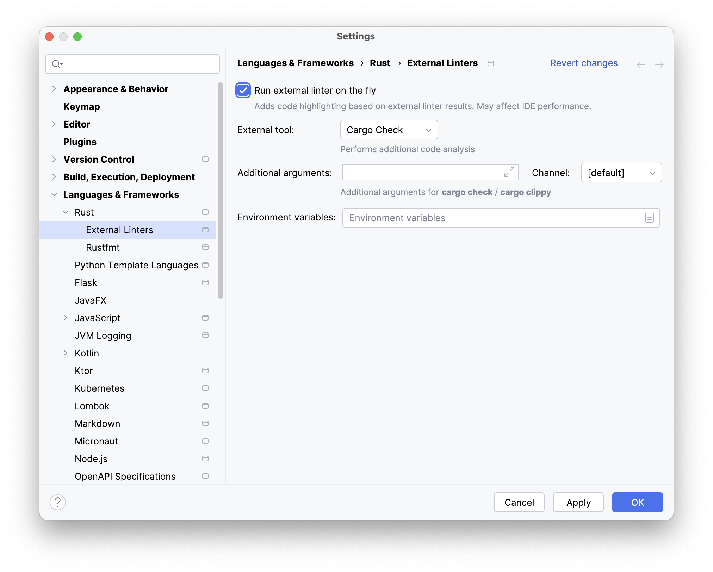

IntelliJ Rust plugin doesn't detect all the errors. It relies on the Rust compiler to do that. While you are learning Rust, it is useful to see errors as you type. To have this behavior, we recommend to enable an external linter as follows.

Once you do that, %IDE_NAME% will report all the errors IntelliJ Rust plugin or Rust compiler detect.

Depending on the IDE you are using, the flow may be slightly different.

### RustRover
1. Go to **Settings / Preferences | Rust | External Linters**.
2. Set the parameters as follows:
   - Check the **Run external linter on the fly** checkbox.
   - Select **Cargo Check** in the **External Tool:** list;

3. Press **OK**.

### IntelliJ IDEA
1. Go to **Settings / Preferences | Languages & Frameworks | Rust | External Linters**.
2. Set the parameters as follows:
   - Check the **Run external linter on the fly** checkbox.
   - Select **Cargo Check** in the **External Tool:** list;

3. Press **OK**.
